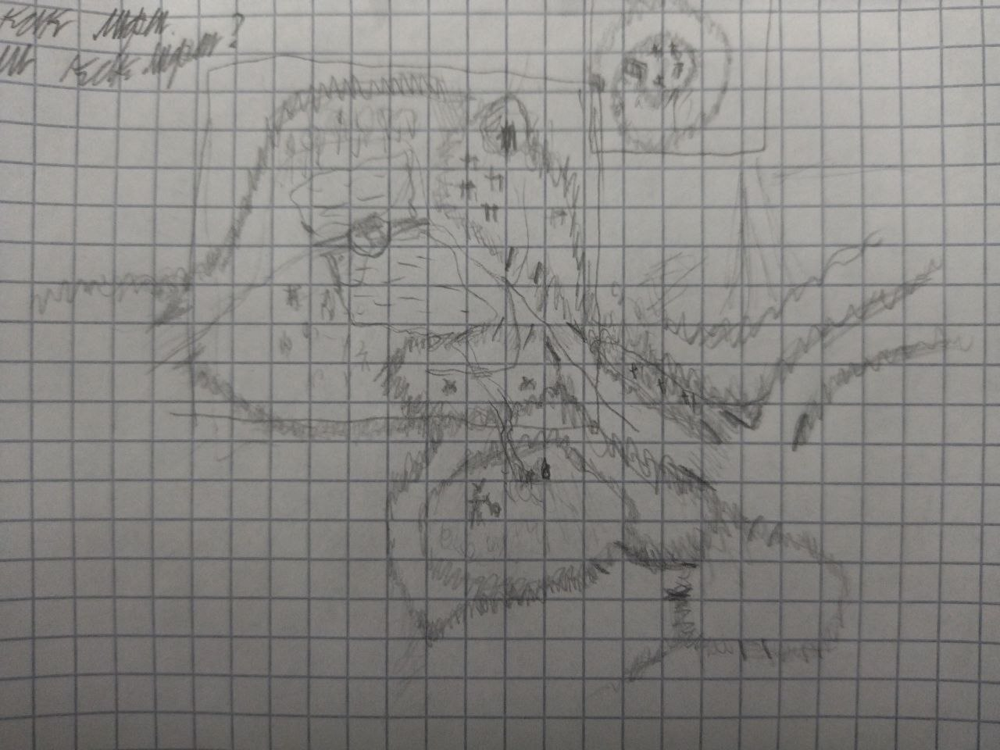
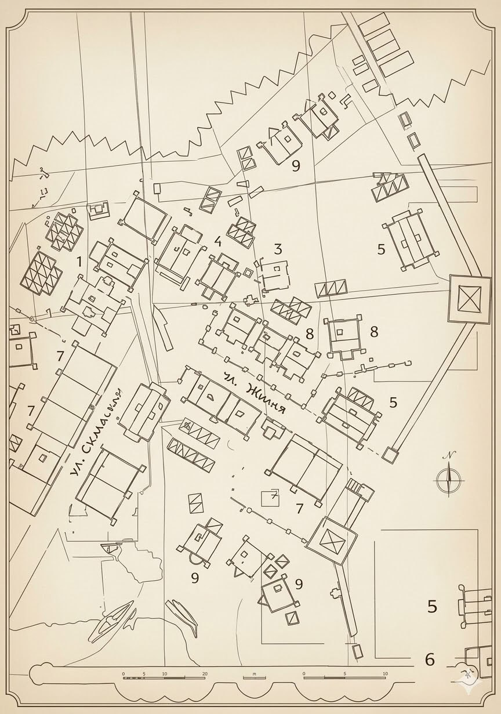

в ориг ПЗ ландшафт построен через разделение высот и холмы-преграды. При этом, достаточно ярко только в 3х местах - гора совета, дорога к знахарке и проход по горам в дальних горах.

продолжить эту систему, комбинируя чёткие спады и подъёмы. 

У оригинальной игры весьма ограниченные углы наклона, по которым персонаж может передвигаться, более того, даже если может, то идти вверх будет гораздо замедленнее.

при этом плавные холмы так же допустимы, но выполняют больше декоративную функцию.

Вода (реки, озёра) тоже выполняют важную роль разделения локаций на регионы.

оригинальные поселения находятся на равнинах, можно поэкспериментировать с формой ландшафта у городов

